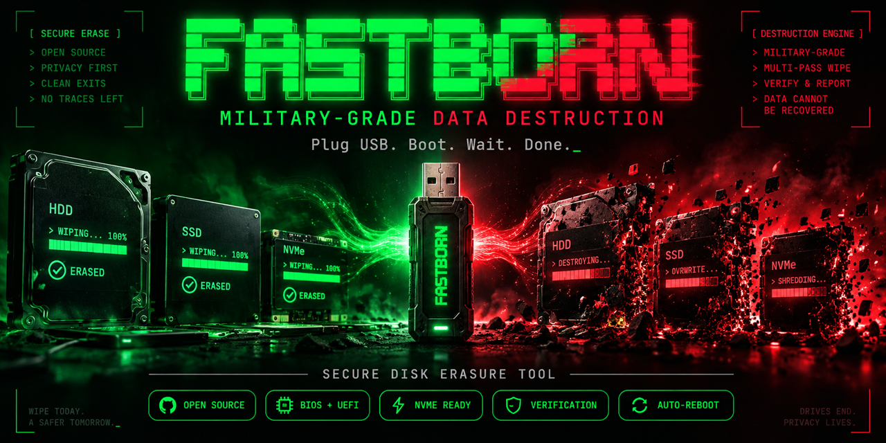
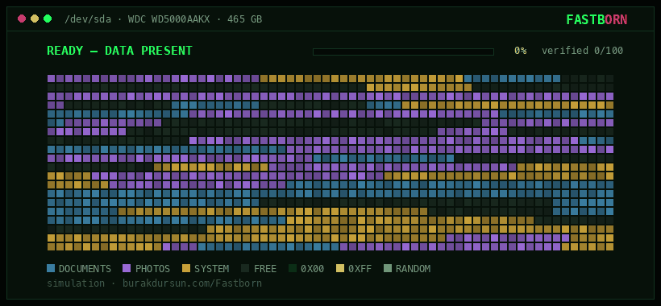

<div align="center">

<a href="https://burakdursun.com/Fastborn/"></a>

### Plug USB. Boot. Wait. Done.

Zero-touch bootable USB that wipes every internal disk and leaves a verified report behind.<br>
The open-source DBAN alternative for internet cafés, offices and school labs.

[](https://github.com/badursun/Fastborn/releases/latest)
[](LICENSE)
[](https://github.com/badursun/Fastborn/releases/latest)
[](#features)
[](https://burakdursun.com/Fastborn/)

**[⬇ Download fastborn.iso (v1.0)](https://github.com/badursun/Fastborn/releases/latest/download/fastborn.iso)** &nbsp;·&nbsp; **[▶ Live demo](https://burakdursun.com/Fastborn/#lab)** &nbsp;·&nbsp; **[Türkçe](README-tr.md)**

</div>

---

> [!CAUTION]
> **Irreversible.** Booting a machine from this stick wipes **all of its internal disks** — auto mode has no confirmation prompt. Never plug it into the wrong machine. The boot stick itself is excluded automatically (`removable=1`), and you get a 5-second window (Ctrl+C) before erasure starts.

## Quick start

| Step | What to do |
|---|---|
| **1. Download** | [`fastborn.iso`](https://github.com/badursun/Fastborn/releases/latest/download/fastborn.iso) — ~20 MB |
| **2. Write to USB** | Windows: [Rufus](https://rufus.ie) in **DD Image** mode · macOS: `sudo dd if=fastborn.iso of=/dev/rdiskX bs=1m` · Linux: `sudo dd if=fastborn.iso of=/dev/sdX bs=1M` |
| **3. Boot** | Plug in → power on → walk away |

```
Plug USB → Power on → GRUB menu (3s) → Quick Erase auto-starts
→ All disks wiped in parallel → Verified → JSON log written to USB → Auto reboot
→ Pull USB → Insert OS install media → Install
```

<details>
<summary><b>Verify the download (SHA-256)</b></summary>

```
6f1380a91a61bec991f5e6787a75df8b62c86ed69685c9539fdd86d9bf6a29dc  fastborn.iso
```

```bash
shasum -a 256 fastborn.iso      # macOS
sha256sum fastborn.iso          # Linux
certutil -hashfile fastborn.iso SHA256   # Windows
```

</details>

## See it work

<div align="center">
<a href="https://burakdursun.com/Fastborn/#lab"></a>
<br><sub>Simulation of a Full (DoD 7-pass) wipe. Try it yourself in the <a href="https://burakdursun.com/Fastborn/#lab">interactive wipe lab</a>.</sub>
</div>

## Erase modes

GRUB waits **3 seconds**. Touch nothing and Quick mode starts; choose Full from the menu for sensitive data.

| | **Quick** (default) | **Full** |
|---|---|---|
| Method | 1-pass zero fill (`0x00`) | DoD 5220.22-M, 7 passes via nwipe |
| Pattern | `0x00` | `0x00 → 0xFF → RND → 0x00 → 0xFF → RND → RND` |
| Time (80 GB) | ~15–20 min | ~2+ hours |
| Best for | Internet cafés, offices, labs — also clears boot-sector malware | Drives that held sensitive data |
| Log method | `quick-1pass-zero` | `full-dod522022m-7pass` |

## Features

- **Zero-touch** — plug in, power on, don't touch anything
- **Parallel wipe** — every internal disk at once: SATA, HDD, SSD and NVMe
- **Verification pass** — reads back 100 random sectors per disk after the wipe
- **JSON report** — one log per disk written to the stick under `/fastborn-logs/`
- **Auto-reboot** — 5-second countdown when done; pull the stick and install the OS
- **BIOS + UEFI** — one hybrid ISO, boots from USB or CD
- **~20 MB, runs from RAM** — target disks are never touched during boot
- **Boot-stick protection** — removable devices (`removable=1`) are always skipped
- **Modern kernel** — Linux 6.6 LTS

## Why FastBorn?

DBAN was sold to Blancco and frozen on an ancient kernel; nwipe is great but isn't bootable on its own. FastBorn wraps a modern kernel and nwipe into a stick you can hand to anyone.

| Feature | FastBorn | DBAN | nwipe |
|---|:---:|:---:|:---:|
| Zero-touch (plug & run) | ✅ | ❌ | ❌ |
| NVMe support | ✅ | ❌ | ✅ |
| Quick mode (1-pass) | ✅ | ❌ | ✅ |
| JSON erasure report | ✅ | ❌ | ❌ |
| Verification pass | ✅ | ❌ | ❌ |
| Auto-reboot | ✅ | ❌ | ❌ |
| Modern kernel | ✅ 6.6 LTS | ❌ 2.6.x | ~ distro |
| Bootable ISO | ✅ | ✅ | ❌ needs ShredOS |
| Active development | ✅ | ❌ | ✅ |

## Erasure report

Written automatically to the stick under `/fastborn-logs/`, one file per disk:

```json
{
  "tool": "FastBorn v1.0",
  "timestamp": "2026-03-20T14:30:00Z",
  "hostname": "PC-042",
  "disk": {
    "device": "/dev/sda",
    "model": "WDC WD5000AAKX",
    "serial": "WD-ABC123",
    "size": "465GB",
    "size_bytes": 500107862016
  },
  "erasure": {
    "method": "quick-1pass-zero",
    "mode": "quick",
    "duration_seconds": 1024,
    "status": "success"
  },
  "verification": {
    "result": "PASS",
    "sectors_checked": 100
  }
}
```

## Roadmap — V2

V2 is in development and rebuilds FastBorn around fail-closed safety and verifiable evidence:

- **Native sanitize** — NVMe Format / Sanitize and ATA Sanitize, with full readback for HDD overwrites
- **Hardware qualification** — an exact-match, default-deny registry of approved device profiles
- **Parallel coordinator** — failure-isolated workers driven by a hashed, frozen execution manifest
- **Signed evidence** — detached Ed25519 report signatures and NIST Appendix C aligned sanitization certificates

> [!NOTE]
> V2 is **not a qualified release yet**. Use v1.0 for real work today.

## Writing to USB (detailed)

<details>
<summary><b>Windows — Rufus (recommended)</b></summary>

1. Download [Rufus](https://rufus.ie) (portable, no install)
2. Plug in the USB stick
3. In Rufus:
   - **Device:** your USB stick
   - **Boot selection:** "Disk or ISO image" → SELECT → `fastborn.iso`
   - **Partition scheme:** MBR
   - **Target system:** BIOS or UEFI
   - Click **START**
4. When prompted, choose **DD Image** mode → OK

</details>

<details>
<summary><b>Windows — balenaEtcher</b></summary>

1. Download [Etcher](https://etcher.balena.io)
2. "Flash from file" → `fastborn.iso`
3. "Select target" → your USB stick
4. "Flash!"

</details>

<details>
<summary><b>macOS</b></summary>

```bash
diskutil list                                   # find the USB disk number
diskutil unmountDisk /dev/diskX                 # X = disk number
sudo dd if=fastborn.iso of=/dev/rdiskX bs=1m status=progress   # rdisk = faster
diskutil eject /dev/diskX
```

</details>

<details>
<summary><b>Linux</b></summary>

```bash
lsblk                                           # find the USB device
sudo dd if=fastborn.iso of=/dev/sdX bs=1M status=progress conv=fsync
```

</details>

## Build from source

Requires Docker Desktop.

```bash
git clone https://github.com/badursun/Fastborn.git
cd Fastborn
chmod +x build.sh
./build.sh
```

Output: `output/fastborn.iso`

## License

MIT — see [LICENSE](LICENSE). Provided as is, with no warranty; use at your own risk.

<div align="center"><sub><b>Drives end. Privacy lives.</b> · <a href="https://burakdursun.com/Fastborn/">burakdursun.com/Fastborn</a></sub></div>
